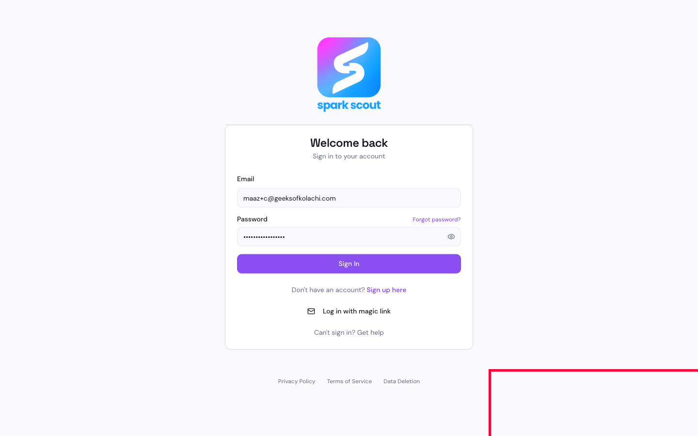

# BUG-001: When you type the wrong password, the app doesn't tell you

## Short Summary
If you type the wrong password and hit "Sign In," nothing happens on screen. There's no red error message, no popup, nothing. The page just quietly resets the password box, and you're left guessing why it didn't work.

## Steps to Reproduce
1. Go to the sign-in page.
2. Type your correct email address.
3. Type a **wrong** password on purpose.
4. Click "Sign In."

## Expected Result
A clear message should appear telling you the password is wrong, like "Invalid credentials" or "Incorrect password, please try again."

## Actual Result
Nothing visible happens. The password field just goes blank again. There is no message anywhere on the screen telling you what went wrong.

Behind the scenes, we found something interesting: the app actually *does* create the error message ("Sign in failed — Invalid credentials") and *does* put it in the right corner of the screen. But it's invisible — the box that's supposed to hold the message has no height, like a picture frame with no room for the picture. So the message technically exists, but no human can ever see it.

## Evidence

The screenshot above shows the login form right after submitting a wrong password. The red box marks the exact spot where the "Invalid credentials" message is sitting — completely invisible.

**Video:** [BUG-001-video.webm](BUG-001-video.webm) — shows the wrong-password login live, waits on the blank result so you can see nothing appears, then draws a box around the exact hidden spot where the "Invalid credentials" message actually is.

## Why This Matters
A user who mistypes their password has no idea what happened. They'll likely just keep retrying blindly, get frustrated, or assume the app is broken.
