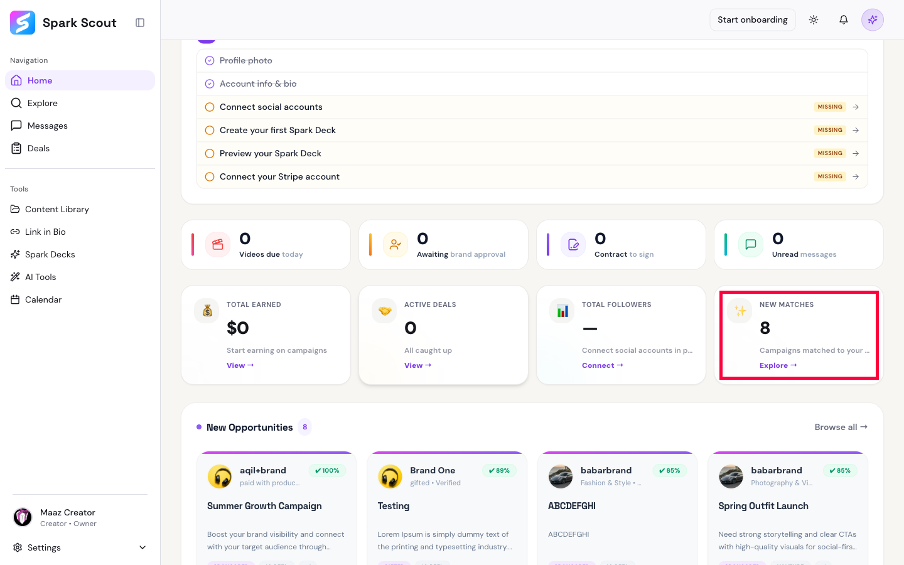
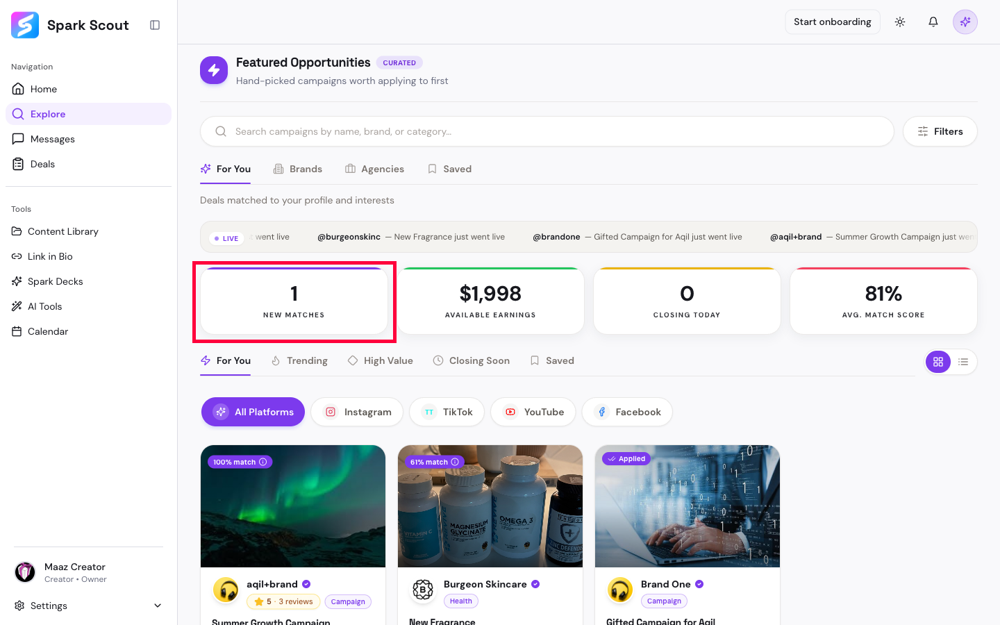

# BUG-002: "New Matches" number doesn't match across pages

## What's Wrong
The number of "New Matches" should be the same everywhere it's shown. It isn't.

## How to See It
1. Log in and check the "New Matches" number on the Home page.
2. Go to the Explore page and check the same number there.
3. They don't match.

## Expected Result
Same number, every time, everywhere it's shown.

## Actual Result
- Home page shows **8** (and shows it again lower down as "New Opportunities 8")
- Explore page showed **1**, then showed **0** a few seconds later after just refreshing — nothing was clicked in between

## Screenshots

Red boxes mark the same stat, showing different numbers on each page.

## Why It Matters
Users check this number to see if anything new is worth looking at. If it keeps changing for no reason, they can't trust it — and might stop trusting other numbers in the app too.
