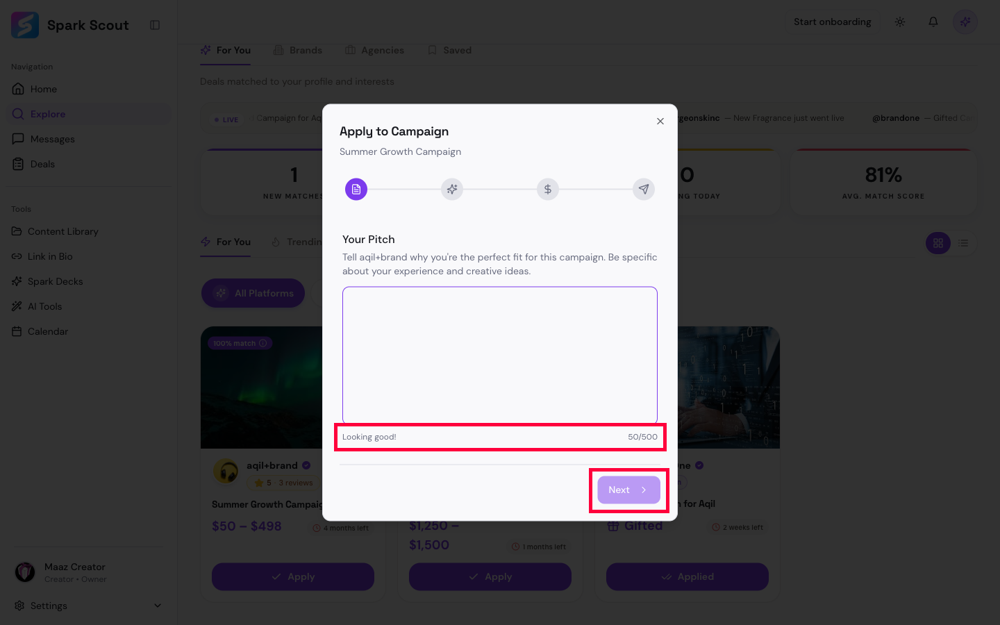

# BUG-003: Typing just blank spaces into "Your Pitch" tricks the form into looking done

## Short Summary
When applying to a campaign, there's a "Your Pitch" box where you're supposed to write a message to the brand. If you fill it with nothing but blank spaces (no real words), the app cheerfully says "Looking good!" as if you'd written something real. The one saving grace: it does quietly stop you from actually moving forward — but it doesn't look that way.

## Steps to Reproduce
1. Open a campaign and click "Apply."
2. In the "Your Pitch" box, type 50 spacebar presses — no real words, just blank space.
3. Look at the helper text under the box, and at the "Next" button.

## Expected Result
The app should recognize that blank spaces aren't a real pitch, and either:
- Show a message like "Please write an actual pitch," or
- Clearly grey out the "Next" button so it's obvious you can't continue.

## Actual Result
- The helper text says **"Looking good!"** and the counter shows **"50/500"** — both signals that everything is fine.
- The "Next" button is still technically disabled (clicking it does nothing), but it's colored the same solid purple as a normal, clickable button. There is no visual difference between "ready to go" and "secretly blocked."

## Evidence

Both problem spots are boxed in red: the false "Looking good!" message, and the "Next" button that looks active but silently does nothing.

## Why This Matters
This is a confusing dead end — the app is telling the user two contradictory things at once ("you're good to go" vs. "you can't proceed"), and the user has no clue why they're stuck.
