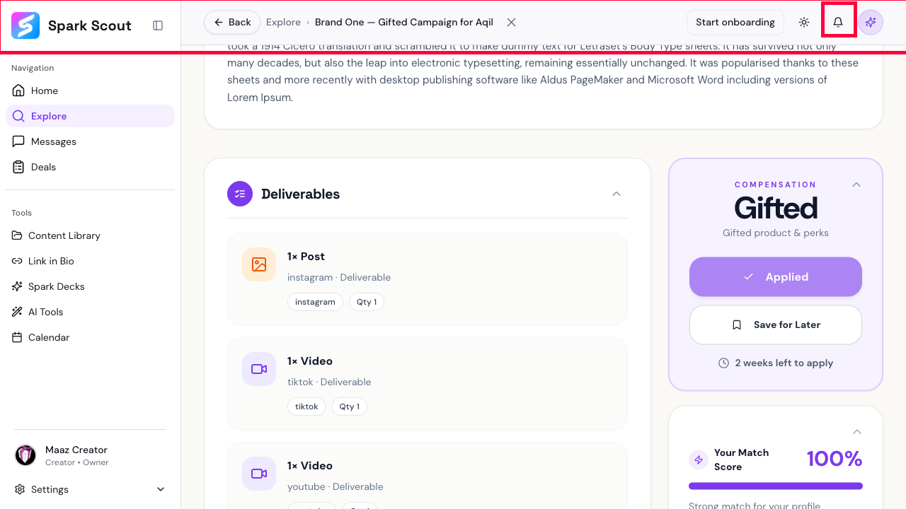

# BUG-004: No "you're done!" message after applying to a campaign

## Short Summary
After going through all the steps to apply to a campaign and hitting the final submit button, the app doesn't say "success" anywhere. The application does go through correctly behind the scenes — but the user isn't told that in any visible way.

## Steps to Reproduce
1. Open a campaign and click "Apply."
2. Fill out all the steps of the application (pitch, optional Spark Deck, pricing).
3. Click the final submit button.
4. Watch the top of the screen for any confirmation message.

## Expected Result
A clear confirmation message should pop up, like "Application submitted!" or "You're in! We'll notify you if the brand responds."

## Actual Result
No message appears anywhere on screen. The only hint that anything happened is that the "Apply" button on the campaign card quietly changes to a greyed-out "Applied" label. If you weren't watching that one button closely, you'd have no idea whether your application actually went through.

## Evidence

The screenshot is taken right after a successful application. The whole top bar (and specifically the notification bell, boxed in red) is checked — there is no banner, popup, or badge confirming success anywhere.

**Video:** [BUG-004-video.webm](BUG-004-video.webm) — opens the already-submitted application, highlights the top-right corner to show no confirmation banner is present, then jumps to Deals > Pending to prove the application really did go through successfully behind the scenes.

*Note: this video shows the aftermath of a real, already-successful application rather than a fresh live submission — a second attempt to submit a brand-new paid application during recording hit an unrelated "connect Stripe first" requirement that would have needed linking a real payment account, so it wasn't used for this recording. The Deals > Pending step in the video confirms the original application really did succeed with zero visible feedback at the time.*

## Why This Matters
Applying to a campaign is a meaningful action for a creator — they deserve clear confirmation it worked, especially since this is the same "no feedback" pattern also seen on login (see BUG-001). This suggests the app's notification/toast system isn't consistently wired up across actions.
