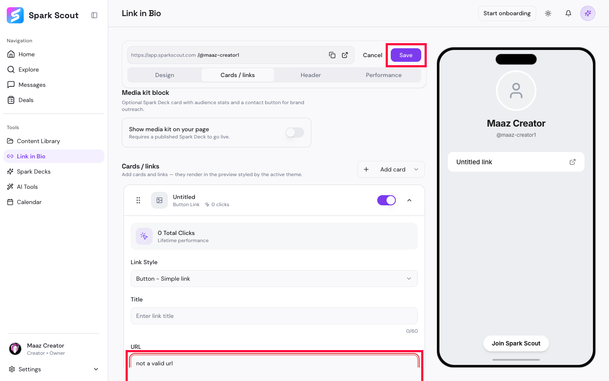
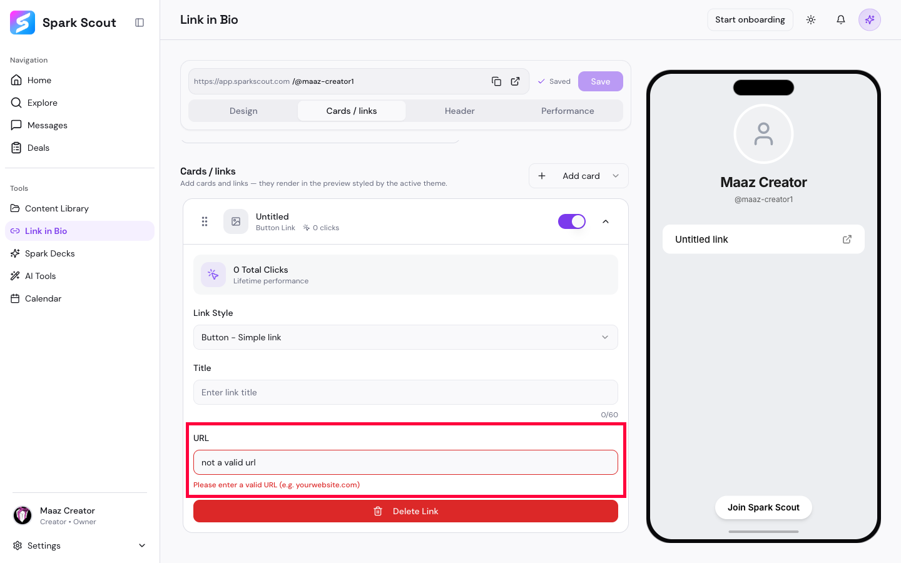

# BUG-005: A broken link gets saved and goes live, even though the app says it's invalid

## Short Summary
On the "Link in Bio" page (the public page creators share with their followers), typing a broken, made-up web address into a link button shows a red warning — but the "Save" button lets you save it anyway. After saving and reloading the page, the broken link is still there, still turned on, which means it would show up as a real, clickable — but dead — button on the creator's public page.

## Steps to Reproduce
1. Go to "Link in Bio" → "Cards / links."
2. Add a new button-style link.
3. In the URL box, type something that isn't a real web address, like `not a valid url`.
4. Notice the red warning underneath: "Please enter a valid URL."
5. Click the "Save" button at the top anyway.
6. Reload the whole page.
7. Open that same link card again.

## Expected Result
One of two things should happen:
- The "Save" button should be greyed out / blocked while the warning is showing, so a broken link can never be saved, OR
- If it is saved, it definitely shouldn't be switched "on" and visible to the public.

## Actual Result
- The warning shows up, but "Save" is still fully clickable and works.
- After reloading, the broken text `not a valid url` is still sitting in the URL box, and the red warning is still showing — meaning it truly saved, warning and all.
- The card's toggle is still switched ON, meaning this dead link would appear as a real, clickable button on the creator's live public page that fans and brands visit.

## Evidence

**Video:** [BUG-005-video.webm](BUG-005-video.webm) — types the broken URL, shows the red warning, clicks Save anyway, reloads the whole page, and reopens the card to prove the broken URL and warning are both still there. Ends with the test link being deleted again on camera.

## Why This Matters
This isn't just a form validation slip — it's a link that real fans or brand partners could click on the creator's public profile and hit a dead end. The visible warning gives a false sense of safety since it doesn't actually stop anything.

*Note: the test link was deleted immediately after confirming this bug, so nothing broken was left live on the account.*
