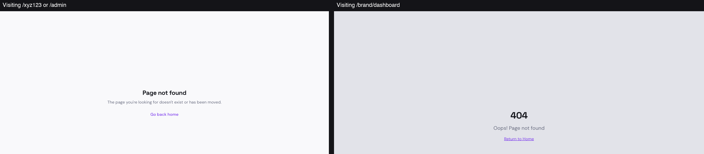

# BUG-007: Typing a wrong web address shows two completely different "not found" pages

## Short Summary
If you type a page address that doesn't exist, you sometimes get one "page not found" screen, and other times you get a completely different-looking one — different colors, different wording, different button — depending on exactly what you typed. On top of that, one version quietly tries (and fails) to fetch data first, leaving an error in the technical console.

## Steps to Reproduce
1. While logged in, go to a made-up single-word address, e.g. `sparkscout.com/xyz123` or `sparkscout.com/admin`.
2. Note what the "not found" page looks like.
3. Now go to a made-up multi-part address, e.g. `sparkscout.com/brand/dashboard`.
4. Compare what that "not found" page looks like.

## Expected Result
Every broken/unknown web address in the app should show the exact same "page not found" screen — same colors, same wording, same button — so it's a consistent, polished experience no matter what someone typed.

## Actual Result
Two entirely different "not found" pages exist:
- **Single-word addresses** (like `/xyz123` or `/admin`) show a light page that says "Page not found — The page you're looking for doesn't exist or has been moved" with a "Go back home" link. Before showing this, the app secretly tries to look up that word as if it might be someone's public profile page, fails, and logs an error in the background.
- **Multi-part addresses** (like `/brand/dashboard`) show a different page entirely — grey background, big "404," "Oops! Page not found," and a "Return to Home" link — with no extra hidden lookup happening first.

## Evidence

The left side shows what you see visiting a single-word address; the right side shows what you see visiting a multi-part address. Same mistake (a broken link), two very different results.

**Video:** [BUG-007-video.webm](BUG-007-video.webm) — visits a single-word broken address first, then a multi-part broken address, back to back, so you can see the two different "not found" pages appear one after another.

## Why This Matters
This is confusing and looks unfinished — a user bookmarking or mistyping a link could land on either version and might reasonably think one of them is a "more broken" error than the other. It's also doing unnecessary background work (the failed lookup) for something that should just show a simple error page immediately.

**Good news:** we also specifically checked whether a regular Creator account could sneak into admin-only or brand-only areas this way, and the answer is no — both attempts were correctly blocked. This bug is only about the two error pages looking and behaving differently, not about anyone getting access they shouldn't.
