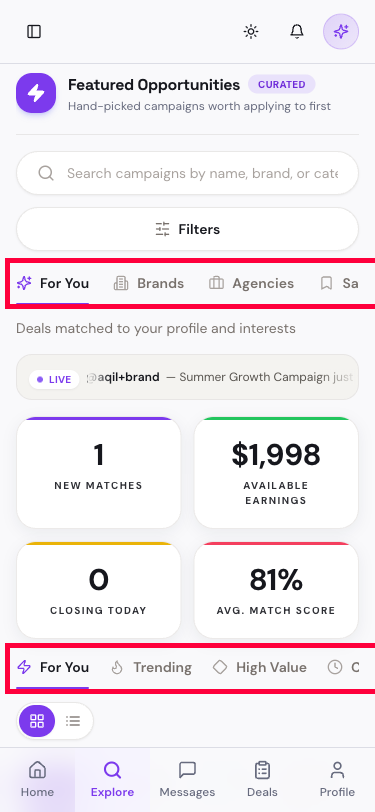

# BUG-008: On a phone screen, some tabs on the Explore page get cut off mid-word

## Short Summary
On a phone-sized screen, the row of tabs at the top of the Explore page ("For You / Brands / Agencies / Saved") and the row just below it ("For You / Trending / High Value / Closing Soon / Saved") both run off the right edge of the screen. The last tab in each row is chopped off mid-word, and there's no arrow, fade, or scroll hint telling you there's more to see.

## Steps to Reproduce
1. Open the Explore page on a phone, or shrink a browser window down to phone width (about 375px wide).
2. Look at the row of tabs just under the search bar, and the row of tabs just under the stat cards.

## Expected Result
On a narrow screen, tabs should either wrap onto a second line, scroll smoothly with a visible hint (like a fade or arrow) that there's more content, or collapse into a "More" menu — but every tab's full name should always be readable somehow.

## Actual Result
- The top row shows "For You / Brands / Agencies / Sa" — the word "Saved" is chopped down to just "Sa."
- The second row shows "For You / Trending / High Value / C" — "Closing Soon" is chopped down to just "C."
- Nothing on screen hints that these rows are scrollable or that more tabs exist off-screen.

## Evidence

Both problem rows are boxed in red — you can see the labels getting chopped off right at the edge of the screen.

## Why This Matters
A phone user has no way to know "Sa" and "C" are actually full tabs ("Saved" and "Closing Soon") — they might think those are just visual glitches, or not realize those options exist at all.
