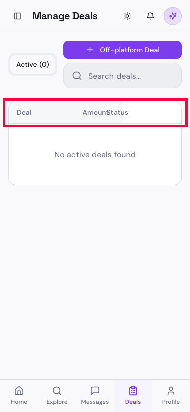
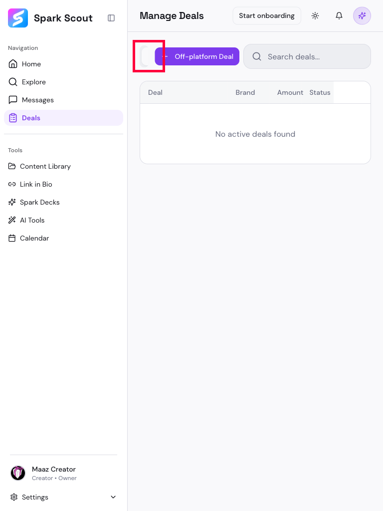

# BUG-009: The Deals page breaks in two different ways on phone and tablet screens

## Short Summary
The Deals page has real problems on smaller screens. On a phone, two of the table's column titles ("Amount" and "Status") overlap and become unreadable. On a tablet, the row of filter tabs (Active / Offers / Pending / Completed / Other) — which is how you switch between different groups of deals — almost completely disappears, leaving just a tiny unreadable sliver on the edge of the screen.

## Steps to Reproduce — Phone-width overlap
1. Open the Deals page on a phone, or shrink a browser window to phone width (about 375px wide).
2. Look at the column titles at the top of the deals table.

## Steps to Reproduce — Tablet-width missing tabs
1. Open the Deals page on a tablet, or resize a browser window to tablet width (about 768px wide).
2. Look for the row of filter buttons (Active, Offers, Pending, Completed, Other) that normally sits above the table.

## Expected Result
- Column titles should never overlap or become unreadable at any screen size.
- The filter tabs (Active/Offers/Pending/etc.) should always be visible and usable, since they're the main way to find a specific group of deals — on any screen size.

## Actual Result
- **On phone width:** the table correctly hides some less-important columns (Brand, Deliverables, Deadline) to save space — that part is fine. But the two columns that remain, "Amount" and "Status," are squeezed on top of each other and read as garbled text like "AmounStatus."
- **On tablet width:** the filter tabs are almost entirely pushed off the visible screen. Only a tiny curved sliver is visible at the edge — a user would have no way to know those buttons are even there, let alone click the one they want. (We confirmed the buttons do still technically exist "behind the scenes," they're just not visible or usable.)

## Evidence

## Why This Matters
Deals is one of the most important pages for a Creator — it's where they track their active work and money. On a tablet, they'd effectively lose the ability to filter/find the right deals at all without knowing to guess-click a sliver of pixels. On mobile, the unreadable header makes the table look broken and unpolished.
